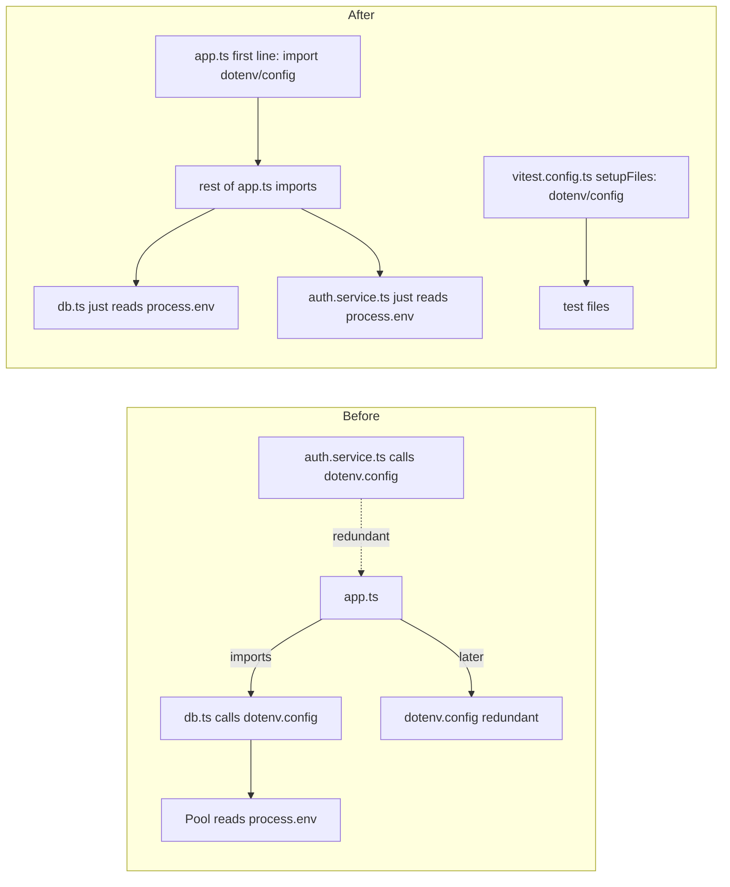

## F-24 fix: centralize `dotenv.config()`

### Goal
`dotenv.config()` must run **once**, **before any other module evaluates `process.env`**, and library code must never touch dotenv.

### Why the current code is fragile
- [src/core/config/db.ts](healthy-paws-service/src/core/config/db.ts) builds `new Pool({ user: process.env.DB_USER, … })` at module load.
- [src/app.ts](healthy-paws-service/src/app.ts) imports `db.ts` on line 14 but calls `dotenv.config()` on line 25 — `db.ts` only works because it *also* calls `dotenv.config()`.
- [src/features/authentication/authentication.service.ts](healthy-paws-service/src/features/authentication/authentication.service.ts) calls `dotenv.config()` defensively, even though all its `process.env` reads happen inside methods.
- Other modules that read env at load time (e.g. [passport-config.ts](healthy-paws-service/src/core/middleware/passport-config.ts) reading `JWT_SECRET`, [email.ts](healthy-paws-service/src/core/config/email.ts) reading `APP_NAME`) silently depend on the order above.

### Approach
Use the side-effect import `import "dotenv/config";` as the very first line of `src/app.ts`. Side-effect imports run in source order at module load, so `.env` is parsed into `process.env` before any other `import` evaluates. Then remove dotenv from all non-entry-point modules. For tests, register `dotenv/config` via Vitest's `setupFiles` so tests get the same single load.

### Changes

1. **[src/app.ts](healthy-paws-service/src/app.ts)** — replace the current dotenv usage with a hoisted side-effect import at the very top of the file:
   - Remove `import * as dotenv from "dotenv";` (line 3) and `dotenv.config();` (line 25).
   - Add as line 1: `import "dotenv/config";`
   - Keep all other imports below it, unchanged in order.

2. **[src/core/config/db.ts](healthy-paws-service/src/core/config/db.ts)** — remove the dotenv coupling:
   - Delete `import dotenv from "dotenv";` (line 2) and `dotenv.config();` (line 4).
   - `process.env.DB_*` reads stay as-is.

3. **[src/features/authentication/authentication.service.ts](healthy-paws-service/src/features/authentication/authentication.service.ts)** — remove the redundant dotenv call:
   - Delete `import * as dotenv from "dotenv";` (line 4) and `dotenv.config();` (line 23).

4. **[vitest.config.ts](healthy-paws-service/vitest.config.ts)** — ensure tests also load env exactly once:
   - Add `setupFiles: ["dotenv/config"]` inside the `test` block.
   - This replaces what `authentication.service.ts`'s own `dotenv.config()` used to do for tests, in one central place.

### Notes / non-goals
- No changes to npm scripts; `tsx watch src/app.ts` and `node dist/app.js` both pick up the first-line `import "dotenv/config"` automatically.
- No new module is needed (e.g. `loadEnv.ts`) — a single side-effect import at the entry point is sufficient and is the idiomatic dotenv pattern.
- Env-validation/schema (e.g. Zod) is out of scope for F-24; this finding is strictly about *where* `dotenv.config()` is called.
- `dotenv` stays as a runtime dependency in `package.json`.

### Verification
- `npm run watch` boots and connects to the DB (proves `db.ts` sees `DB_*` without calling dotenv itself).
- `npm run test` passes (proves `setupFiles: ["dotenv/config"]` covers the test path).
- `rg "dotenv" src` returns no matches outside of `app.ts`.