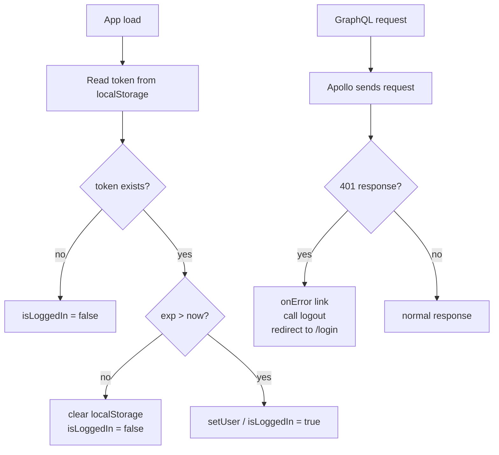

# Fix F-11: No refresh tokens; client never recovers from token expiry

## The two problems

### 1. Expired token accepted on app load

In [`context/AuthenticationContext.tsx`](healty-paws-frontend/src/context/AuthenticationContext.tsx), the `useEffect` that runs on mount calls `jwtDecode(token)` but **never inspects `exp`**. `jwtDecode` does not verify expiry — it only deserialises the payload. A user who closes the tab and reopens it hours later appears still logged in, but every API call fails:

```ts
// current code — no expiry check
const decodedUser: User = jwtDecode(token);
setUser(decodedUser);
setIsLoggedIn(true);  // ← always true, even if token expired 3 hours ago
```

### 2. Mid-session expiry leaves the UI silently broken

In [`lib/graphql/apollo-wrapper.tsx`](healty-paws-frontend/src/lib/graphql/apollo-wrapper.tsx) the Apollo client has no `onError` link. When the 1-hour token expires during an active session, every GraphQL request returns a 401 that is swallowed — queries fail, UI shows nothing, and the user has no way to recover:

```ts
// current code — no error link
const apolloClient = new ApolloClient({
  link: authLink.concat(httpLink),  // ← no error handling
  cache,
});
```

## The fix



### Fix 1 — Expiry check on app load (`AuthenticationContext.tsx`)

Add a helper and use it in the `useEffect`:

```ts
const isTokenExpired = (token: string): boolean => {
  try {
    const { exp } = jwtDecode<{ exp?: number }>(token);
    if (!exp) return true;
    return Date.now() >= exp * 1000;
  } catch {
    return true;
  }
};

// inside useEffect:
const token = localStorage.getItem("accessToken");
if (token) {
  if (isTokenExpired(token)) {
    localStorage.removeItem("accessToken");
    setIsLoggedIn(false);
  } else {
    const decodedUser: User = jwtDecode(token);
    setUser(decodedUser);
    setIsLoggedIn(true);
  }
}
```

### Fix 2 — Apollo `onError` link for mid-session 401 (`apollo-wrapper.tsx`)

Import `onError` from `@apollo/client/link/error` and wire it into the link chain. On a network 401, call `logout()` and redirect to `/login`:

```ts
import { onError } from "@apollo/client/link/error";

const errorLink = onError(({ networkError }) => {
  if (networkError && "statusCode" in networkError && networkError.statusCode === 401) {
    localStorage.removeItem("accessToken");
    window.location.href = "/login";
  }
});

const apolloClient = new ApolloClient({
  link: from([errorLink, authLink, httpLink]),
  cache,
});
```

`@apollo/client/link/error` is already included in the `@apollo/client` package — no new dependency needed.

## Why a full refresh-token flow is deferred

Implementing server-issued refresh tokens securely requires storing the refresh token in an **httpOnly cookie** (not localStorage) so it is inaccessible to JavaScript. That storage change is exactly what F-12 addresses. Implementing refresh tokens in localStorage would add a second credential with the same XSS exposure, offering no real security benefit. The right sequencing is: fix F-12 (httpOnly cookie storage) first, then layer the refresh-token endpoint on top.

## Files changed

- [`healty-paws-frontend/src/context/AuthenticationContext.tsx`](healty-paws-frontend/src/context/AuthenticationContext.tsx) — add `isTokenExpired` helper; check expiry on load before setting `isLoggedIn`
- [`healty-paws-frontend/src/lib/graphql/apollo-wrapper.tsx`](healty-paws-frontend/src/lib/graphql/apollo-wrapper.tsx) — add `onError` link; redirect to login on 401