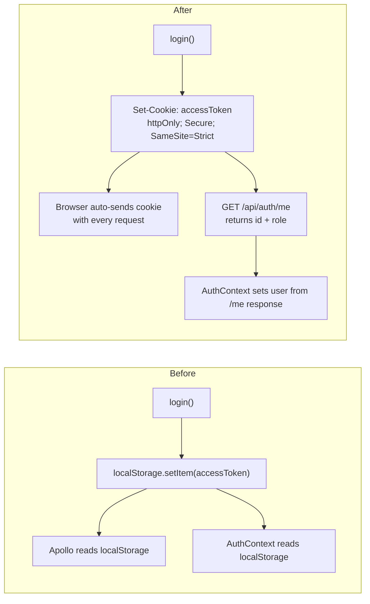

# Fix F-12: JWT stored in localStorage — XSS-exploitable

## The problem

`localStorage` has no protection against XSS: any injected script on the page can do `localStorage.getItem("accessToken")` and steal the JWT. The token is currently written in three places:

- [`LoginPage.tsx`](healty-paws-frontend/src/pages/auth/login/LoginPage.tsx) — `login(data.data.accessToken)`
- [`AuthenticationContext.tsx`](healty-paws-frontend/src/context/AuthenticationContext.tsx) — `localStorage.setItem("accessToken", token)`
- [`apollo-wrapper.tsx`](healty-paws-frontend/src/lib/graphql/apollo-wrapper.tsx) — `localStorage.getItem("accessToken")`

## The fix: httpOnly cookie

The JWT is set by the server as an `httpOnly; Secure; SameSite=Strict` cookie. JavaScript can never read it. The browser sends it automatically on every same-origin request.



---

## Backend changes

### 1. Install `cookie-parser`

```bash
npm install cookie-parser && npm install -D @types/cookie-parser
```

### 2. [`src/app.ts`](healthy-paws-service/src/app.ts) — add `cookieParser()` middleware

```ts
import cookieParser from "cookie-parser";
// ...
app.use(cookieParser());
```

### 3. [`src/core/middleware/passport-config.ts`](healthy-paws-service/src/core/middleware/passport-config.ts) — read JWT from cookie

Replace `ExtractJwt.fromAuthHeaderAsBearerToken()` with a custom extractor that reads from the `accessToken` cookie:

```ts
const cookieExtractor = (req: Request): string | null =>
  req?.cookies?.accessToken ?? null;

const jwtOptions: StrategyOptions = {
  jwtFromRequest: cookieExtractor,
  secretOrKey: JWT_SECRET,
  passReqToCallback: false,
};
```

### 4. [`src/features/authentication/authentication.controller.ts`](healthy-paws-service/src/features/authentication/authentication.controller.ts)

**`login`** — set the httpOnly cookie instead of returning `accessToken` in the body. Still return `role` and `id` so the frontend can set its state:

```ts
res.cookie("accessToken", token, {
  httpOnly: true,
  secure: process.env.NODE_ENV === "production",
  sameSite: "strict",
  maxAge: 60 * 60 * 1000, // 1 hour — matches JWT expiresIn
  path: "/",
});

const response: ApiResponse<{ role: string; id: string }> = {
  status: "success",
  message: SuccessMessages.LOGIN_SUCCESS,
  data: { role: user.role, id: user.id },
};
return res.json(response);
```

**New `logout` handler** — clears the cookie:

```ts
public logout = (_req: Request, res: Response): void => {
  res.clearCookie("accessToken", { path: "/" });
  res.json({ status: "success", message: "Logged out." });
};
```

**New `me` handler** — protected endpoint for session restoration on page load:

```ts
public me = (req: Request, res: Response): void => {
  if (!req.user) {
    res.status(401).json({ status: "error", message: "Unauthorised." });
    return;
  }
  res.json({ status: "success", data: req.user });
};
```

### 5. [`src/features/authentication/authentication.routes.ts`](healthy-paws-service/src/features/authentication/authentication.routes.ts) — add `logout` and `me` routes

```ts
router.post("/logout", authenticationController.logout);
router.get(
  "/me",
  passport.authenticate("jwt", { session: false }),
  authenticationController.me
);
```

---

## Frontend changes

### 6. [`src/api/endpoint.ts`](healty-paws-frontend/src/api/endpoint.ts) — add new endpoints

```ts
export const meEndpoint = "/api/auth/me";
export const logoutEndpoint = "/api/auth/logout";
```

### 7. [`src/context/AuthenticationContext.tsx`](healty-paws-frontend/src/context/AuthenticationContext.tsx)

Full rewrite of the auth flow:
- Remove all `localStorage` reads/writes
- Remove `isTokenExpired` helper (added in F-11 — obsolete now; expiry is enforced server-side via the cookie)
- On mount, call `GET /api/auth/me` with `credentials: "include"` to restore session
- Change `login(token: string)` → `login(id: string, role: string)` — token never touches the client
- `logout` calls `POST /api/auth/logout` to clear the cookie server-side

```ts
// On mount — replace localStorage check:
useEffect(() => {
  fetch(`${API_BASE_URL}${meEndpoint}`, { credentials: "include" })
    .then((res) => (res.ok ? res.json() : null))
    .then((data) => {
      if (data?.data) {
        setUser({ id: data.data.id, username: data.data.email, role: data.data.role });
        setIsLoggedIn(true);
      }
    })
    .catch(() => {})
    .finally(() => setIsLoading(false));
}, []);

// login — called after a successful POST /login:
const login = (id: string, role: string) => {
  setUser({ id, username: "", role });
  setIsLoggedIn(true);
};

// logout — clears the server-side cookie:
const logout = async () => {
  await fetch(`${API_BASE_URL}${logoutEndpoint}`, {
    method: "POST",
    credentials: "include",
  });
  setUser(null);
  setIsLoggedIn(false);
};
```

Context interface type changes: `login: (id: string, role: string) => void`.

### 8. [`src/lib/graphql/apollo-wrapper.tsx`](healty-paws-frontend/src/lib/graphql/apollo-wrapper.tsx)

Remove `authLink` (no more manual Authorization header — the browser sends the cookie automatically). Add `credentials: "include"` to `HttpLink`:

```ts
const httpLink = new HttpLink({
  uri: "http://localhost/graphql",
  credentials: "include",
});

// link chain: just errorLink + httpLink (no authLink needed)
const apolloClient = new ApolloClient({
  link: from([errorLink, httpLink]),
  cache,
});
```

### 9. [`src/pages/auth/login/LoginPage.tsx`](healty-paws-frontend/src/pages/auth/login/LoginPage.tsx)

Update the post-login call to use the new `login(id, role)` signature and read `role` directly from the response body (no more manual JWT base64 decode):

```ts
const { data } = await axios.post(`${API_BASE_URL}${loginEndpoint}`, { email, password }, { withCredentials: true });
login(data.data.id, data.data.role);
const userRole = data.data.role;
// navigate based on userRole...
```

---

## Files changed

**Backend**
- `healthy-paws-service/package.json` — install `cookie-parser` + `@types/cookie-parser`
- [`src/app.ts`](healthy-paws-service/src/app.ts) — add `cookieParser()` middleware
- [`src/core/middleware/passport-config.ts`](healthy-paws-service/src/core/middleware/passport-config.ts) — cookie extractor for JwtStrategy
- [`src/features/authentication/authentication.controller.ts`](healthy-paws-service/src/features/authentication/authentication.controller.ts) — `login` sets cookie; add `logout` and `me`
- [`src/features/authentication/authentication.routes.ts`](healthy-paws-service/src/features/authentication/authentication.routes.ts) — add `POST /logout` and `GET /me`

**Frontend**
- [`src/api/endpoint.ts`](healty-paws-frontend/src/api/endpoint.ts) — add `meEndpoint`, `logoutEndpoint`
- [`src/context/AuthenticationContext.tsx`](healty-paws-frontend/src/context/AuthenticationContext.tsx) — replace localStorage with `/me` call; update `login`/`logout` signatures
- [`src/lib/graphql/apollo-wrapper.tsx`](healty-paws-frontend/src/lib/graphql/apollo-wrapper.tsx) — remove `authLink`; add `credentials: "include"` to HttpLink
- [`src/pages/auth/login/LoginPage.tsx`](healty-paws-frontend/src/pages/auth/login/LoginPage.tsx) — update `login()` call; remove JWT base64 decode