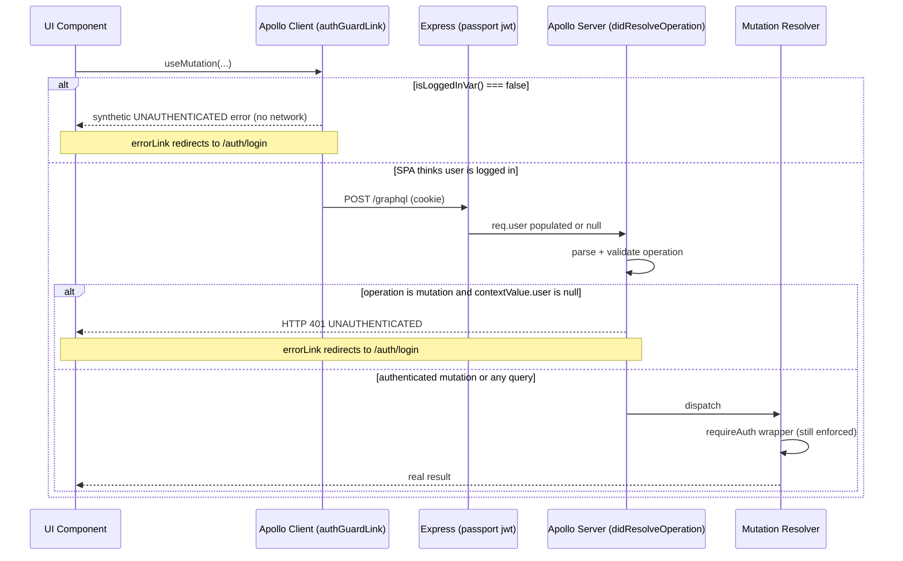

# Fix F-23: Mutations reach Apollo even when unauthenticated

## The problem

Three reachability gaps stack on top of each other today:

**1. Apollo client has no auth gate.** Link chain is just `errorLink -> httpLink`:

```68:71:healty-paws-frontend/src/lib/graphql/apollo-wrapper.tsx
const apolloClient = new ApolloClient({
  link: from([errorLink, httpLink]),
  cache,
});
```

Any `useMutation` callsite sends the request out the door regardless of `AuthenticationContext` state. `errorLink` only reacts *after* the round trip.

**2. Express has no HTTP-level guard.** The JWT middleware on `/graphql` always calls `next()`, then Apollo parses, validates, and dispatches — only `requireAuth` inside the resolver wrapper throws `UNAUTHENTICATED`:

```92:113:healthy-paws-service/src/app.ts
app.use(
  "/graphql",
  (req, res, next) => {
    passport.authenticate("jwt", { session: false }, (err: any, user: any) => {
      if (user) {
        req.user = user;
      }
      next();
    })(req, res, next);
  },
  expressMiddleware(server, {
```

**3. `ProtectedRoute` races the session bootstrap.** It reads `isLoggedIn` (default `false`) and redirects immediately, ignoring `isLoading`:

```20:30:healty-paws-frontend/src/router/ProtectedRoute/ProtectedRoute.tsx
useEffect(() => {
  if (!isClient) {
    return;
  }

  if (!isLoggedIn || !user) {
    navigate(homePath);
    return;
  }
```

That window is exactly when components mount, `useMutation` hooks initialize, and a stray call can hit the network.

`requireAuth` in `resolvers.ts` does still return the correct error, so this is a defense-in-depth and traffic-hygiene fix, not a missing authorization fix.

## The fix

### Frontend

#### New: [`healty-paws-frontend/src/lib/auth/auth-vars.ts`](healty-paws-frontend/src/lib/auth/auth-vars.ts)

Use Apollo's own reactive primitive (`makeVar`) rather than a hand-rolled module singleton. The Apollo link reads them synchronously with `isLoggedInVar()`; React code can subscribe via `useReactiveVar` if needed.

```ts
import { makeVar } from "@apollo/client";

export const isAuthReadyVar = makeVar<boolean>(false);
export const isLoggedInVar = makeVar<boolean>(false);
```

#### [`healty-paws-frontend/src/context/AuthenticationContext.tsx`](healty-paws-frontend/src/context/AuthenticationContext.tsx)

Mirror every auth transition into the reactive vars: bootstrap completion flips `isAuthReadyVar(true)`, login flips `isLoggedInVar(true)`, logout/401 flips it back to `false`.

```ts
import { isAuthReadyVar, isLoggedInVar } from "../lib/auth/auth-vars";

useEffect(() => {
  let cancelled = false;
  (async () => {
    try {
      const res = await fetch(`${API_BASE_URL}${sessionEndpoint}`, { credentials: "include" });
      if (cancelled) return;
      if (res.ok) {
        const data = await res.json();
        setUser({ id: data.id, role: data.role });
        setIsLoggedIn(true);
        isLoggedInVar(true);
      } else {
        if (res.status === 401) {
          fetch(`${API_BASE_URL}${logoutEndpoint}`, { method: "POST", credentials: "include" }).catch(() => {});
        }
        isLoggedInVar(false);
      }
    } catch {
      isLoggedInVar(false);
    } finally {
      if (!cancelled) {
        setIsLoading(false);
        isAuthReadyVar(true);
      }
    }
  })();
  return () => { cancelled = true; };
}, []);

const login = (id: string, role: string) => {
  setUser({ id, role });
  setIsLoggedIn(true);
  isLoggedInVar(true);
};

const logout = () => {
  fetch(`${API_BASE_URL}${logoutEndpoint}`, { method: "POST", credentials: "include" }).catch(() => {});
  setUser(null);
  setIsLoggedIn(false);
  isLoggedInVar(false);
};
```

#### [`healty-paws-frontend/src/lib/graphql/apollo-wrapper.tsx`](healty-paws-frontend/src/lib/graphql/apollo-wrapper.tsx)

Add `authGuardLink` between `errorLink` and `httpLink`. It only inspects mutations — queries (including public `doctors` / `specializations`) pass through untouched. When blocked, it emits a synthetic `UNAUTHENTICATED` GraphQL error so the existing `errorLink` runs the redirect path.

```ts
import { ApolloLink, Observable, FetchResult } from "@apollo/client";
import { GraphQLError, OperationDefinitionNode } from "graphql";
import { isAuthReadyVar, isLoggedInVar } from "../auth/auth-vars";

const isMutation = (operation: { query: any }): boolean =>
  operation.query.definitions.some(
    (d: any): d is OperationDefinitionNode =>
      d.kind === "OperationDefinition" && d.operation === "mutation"
  );

const authGuardLink = new ApolloLink((operation, forward) => {
  if (!isMutation(operation)) return forward(operation);

  if (isAuthReadyVar() && isLoggedInVar()) return forward(operation);

  return new Observable<FetchResult>((observer) => {
    observer.next({
      errors: [
        new GraphQLError("You must be logged in to perform this action", {
          extensions: { code: "UNAUTHENTICATED" },
        }),
      ],
    });
    observer.complete();
  });
});

const apolloClient = new ApolloClient({
  link: from([errorLink, authGuardLink, httpLink]),
  cache,
});
```

Order matters: `errorLink` is outermost so it sees the synthetic error from `authGuardLink` and triggers `handleUnauthenticated()` — same redirect path the user already gets from real 401s.

#### [`healty-paws-frontend/src/router/ProtectedRoute/ProtectedRoute.tsx`](healty-paws-frontend/src/router/ProtectedRoute/ProtectedRoute.tsx)

Respect `isLoading`. While the session boots, render nothing and do not redirect.

```tsx
const { isLoggedIn, user, isLoading } = useAuthentication();

useEffect(() => {
  if (!isClient || isLoading) return;

  if (!isLoggedIn || !user) {
    navigate(homePath);
    return;
  }

  if (allowedRoles && allowedRoles.length > 0 && !allowedRoles.includes(user.role)) {
    navigate(homePath);
  }
}, [isClient, isLoading, isLoggedIn, user, navigate, allowedRoles]);

if (!isClient || isLoading || !isAuthorized) {
  return null;
}
```

This kills the redirect flash for legitimately authenticated users and means mutation hooks no longer mount inside a protected subtree until the session is actually resolved.

### Backend

#### New: [`healthy-paws-service/src/schema/plugins/requireAuthMutations.ts`](healthy-paws-service/src/schema/plugins/requireAuthMutations.ts)

Apollo Server v4 plugin that hooks into `didResolveOperation` — the lifecycle stage that runs **after** Apollo has parsed and validated the document but **before** any resolver runs. Apollo already has the parsed `operation`, so there's no double-parse. Returning a `GraphQLError` with the `http: { status: 401 }` extension makes Apollo Server emit a true HTTP 401, which the existing frontend `errorLink` already handles via its `networkError.statusCode === 401` branch.

```ts
import type { ApolloServerPlugin } from "@apollo/server";
import { GraphQLError } from "graphql";
import type { GraphQLContext } from "../../types";

export const requireAuthMutations: ApolloServerPlugin<GraphQLContext> = {
  async requestDidStart() {
    return {
      async didResolveOperation({ operation, contextValue }) {
        if (operation?.operation !== "mutation") return;
        if (contextValue.user) return;

        throw new GraphQLError(
          "You must be logged in to perform this action",
          {
            extensions: {
              code: "UNAUTHENTICATED",
              http: { status: 401 },
            },
          }
        );
      },
    };
  },
};
```

Queries are untouched — public reads (`doctors`, `specializations`) keep working. The throw inside `didResolveOperation` short-circuits the request, so no resolver (not even the `requireAuth` wrapper) runs for unauthenticated mutations.

#### [`healthy-paws-service/src/app.ts`](healthy-paws-service/src/app.ts)

Register the plugin on `new ApolloServer({ plugins: [...] })`. No new Express middleware needed — the wiring on `/graphql` stays exactly as it is today.

```ts
import { requireAuthMutations } from "./schema/plugins/requireAuthMutations";

const server = new ApolloServer<GraphQLContext>({
  schema,
  plugins: [
    ApolloServerPluginDrainHttpServer({ httpServer }),
    requireAuthMutations,
  ],
});
```

## Flow



## What stays untouched

- `requireAuth` in [`schema/resolvers.ts`](healthy-paws-service/src/schema/resolvers.ts) — still the canonical authorization wrapper, last line of defense behind the plugin.
- `errorLink` in `apollo-wrapper.tsx` — keeps handling both the synthetic frontend error and the new backend 401 through the same `handleUnauthenticated()` path.
- Public queries (`doctors`, `specializations`) — neither layer touches non-mutation operations.
- REST auth endpoints (`/api/auth/login`, `/api/auth/logout`, `/api/auth/session`, registration, password reset) — unchanged; F-23 is GraphQL-only.
- The Passport JWT step in `app.ts` — keeps populating `context.user` exactly as today; the plugin reads from it.

## Verification after change

- Logged-out visitor on `/doctors` tries `createAppointment` via devtools: blocked by `authGuardLink`, no network call, redirected to `/auth/login`.
- Logged-out `curl -X POST /graphql` with a mutation body and no cookie: HTTP 401 with `extensions.code: "UNAUTHENTICATED"`, no resolver ever runs (caught at `didResolveOperation`).
- Logged-out `curl` with a query body: still HTTP 200, public queries keep working.
- Logged-in user mutates from a dashboard: link forwards, plugin passes, resolver runs.
- Token expires mid-session: backend returns HTTP 401 from the plugin (or `UNAUTHENTICATED` from `requireAuth` if it slips through), `errorLink` redirects.
- Reload while logged in: `ProtectedRoute` no longer flashes a redirect during the `/session` round trip.

## Files changed

- [`healty-paws-frontend/src/lib/auth/auth-vars.ts`](healty-paws-frontend/src/lib/auth/auth-vars.ts) — new Apollo `makeVar`s for `isAuthReadyVar` and `isLoggedInVar`.
- [`healty-paws-frontend/src/context/AuthenticationContext.tsx`](healty-paws-frontend/src/context/AuthenticationContext.tsx) — write reactive vars on every auth transition.
- [`healty-paws-frontend/src/lib/graphql/apollo-wrapper.tsx`](healty-paws-frontend/src/lib/graphql/apollo-wrapper.tsx) — add `authGuardLink` reading `isAuthReadyVar()` / `isLoggedInVar()`.
- [`healty-paws-frontend/src/router/ProtectedRoute/ProtectedRoute.tsx`](healty-paws-frontend/src/router/ProtectedRoute/ProtectedRoute.tsx) — respect `isLoading`; don't redirect or render during the bootstrap race.
- [`healthy-paws-service/src/schema/plugins/requireAuthMutations.ts`](healthy-paws-service/src/schema/plugins/requireAuthMutations.ts) — new Apollo Server plugin that throws 401 in `didResolveOperation` for unauthenticated mutations.
- [`healthy-paws-service/src/app.ts`](healthy-paws-service/src/app.ts) — register the plugin on `new ApolloServer({ plugins: [...] })`.
