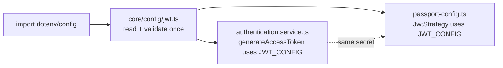

# Fix F-28: JWT_SECRET re-read on every token mint

## The problem

The sign side and verify side handle JWT env loading differently today:

**Sign side — re-reads on every login** ([`authentication.service.ts`](healthy-paws-service/src/features/authentication/authentication.service.ts)):

```33:45:healthy-paws-service/src/features/authentication/authentication.service.ts
public generateAccessToken(payload: JwtPayload): string {
  const secret = process.env.JWT_SECRET;

  if (!secret) {
    throw new SystemError(SystemErrorMessages.JWT_SECRET_UNDEFINED);
  }

  return jwt.sign(payload, secret, {
    expiresIn: (process.env.JWT_EXPIRES_IN ?? "1h") as jwt.SignOptions["expiresIn"],
    issuer:    process.env.JWT_ISSUER   ?? "healthy-paws",
    audience:  process.env.JWT_AUDIENCE ?? "healthy-paws-client",
  });
}
```

**Verify side — caches once at module load** ([`passport-config.ts`](healthy-paws-service/src/core/middleware/passport-config.ts)):

```44:59:healthy-paws-service/src/core/middleware/passport-config.ts
const JWT_SECRET = process.env.JWT_SECRET;
if (!JWT_SECRET) {
  throw new SystemError(SystemErrorMessages.JWT_SECRET_UNDEFINED);
}
// ...
const jwtOptions: StrategyOptions = {
  jwtFromRequest: cookieExtractor,
  secretOrKey:    JWT_SECRET,
  issuer:         process.env.JWT_ISSUER   ?? "healthy-paws",
  audience:       process.env.JWT_AUDIENCE ?? "healthy-paws-client",
};
```

Concrete issues this creates:

- **Inconsistent failure mode.** Missing `JWT_SECRET` crashes Passport at boot but only crashes the sign path on the first successful login. A misconfigured deployment can pass health checks and only fail when a user tries to authenticate.
- **Duplicated env-loading + validation logic.** Two places do the same work; future changes (key rotation, alg selection, etc.) require touching both.
- **Drift risk.** If `process.env.JWT_SECRET` is mutated at runtime (test setups, hot-reload, debugging shells), the sign side sees the new value while the verify side keeps the old — minted tokens won't validate.
- **Hot-path env reads.** `process.env.X` reads four properties on every login. Negligible perf cost; real cost is that they're invisible to the type system and easy to drift.

## The fix

### New: [`src/core/config/jwt.ts`](healthy-paws-service/src/core/config/jwt.ts)

Single source of truth. Reads and validates once at module load; the result is a frozen object so callers cannot mutate it.

```ts
import type { SignOptions } from "jsonwebtoken";
import { SystemErrorMessages } from "../../errors/constants";
import { SystemError } from "../../errors/SystemError";

const secret = process.env.JWT_SECRET;
if (!secret) {
  throw new SystemError(SystemErrorMessages.JWT_SECRET_UNDEFINED);
}

export const JWT_CONFIG = Object.freeze({
  secret,
  expiresIn: (process.env.JWT_EXPIRES_IN ?? "1h") as SignOptions["expiresIn"],
  issuer:    process.env.JWT_ISSUER   ?? "healthy-paws",
  audience:  process.env.JWT_AUDIENCE ?? "healthy-paws-client",
});
```

Matches the project's existing config-module convention ([`core/config/db.ts`](healthy-paws-service/src/core/config/db.ts), [`core/config/email.ts`](healthy-paws-service/src/core/config/email.ts), [`core/config/body-parser.ts`](healthy-paws-service/src/core/config/body-parser.ts)).

### Update: [`src/features/authentication/authentication.service.ts`](healthy-paws-service/src/features/authentication/authentication.service.ts)

Drop the inline env reads and the runtime null check. Consume the shared config.

```ts
import { JWT_CONFIG } from "../../core/config/jwt";

public generateAccessToken(payload: JwtPayload): string {
  return jwt.sign(payload, JWT_CONFIG.secret, {
    expiresIn: JWT_CONFIG.expiresIn,
    issuer:    JWT_CONFIG.issuer,
    audience:  JWT_CONFIG.audience,
  });
}
```

### Update: [`src/core/middleware/passport-config.ts`](healthy-paws-service/src/core/middleware/passport-config.ts)

Drop the inline `JWT_SECRET` load + check; pull from the shared config.

```ts
import { JWT_CONFIG } from "../config/jwt";

const jwtOptions: StrategyOptions = {
  jwtFromRequest: cookieExtractor,
  secretOrKey:    JWT_CONFIG.secret,
  issuer:         JWT_CONFIG.issuer,
  audience:       JWT_CONFIG.audience,
};
```

The runtime check (`if (!JWT_SECRET)`) moves to the config module, where it belongs — boot fails fast if the env is missing.

## Module-load order

`dotenv/config` is the first import in [`app.ts`](healthy-paws-service/src/app.ts) (line 1), so `process.env.JWT_SECRET` is populated before any other module evaluates. Both `authentication.service.ts` (imported transitively via `passport-config.ts`) and `passport-config.ts` load `core/config/jwt.ts` after dotenv has run. No new ordering risk.



## What stays untouched

- All four env var names (`JWT_SECRET`, `JWT_EXPIRES_IN`, `JWT_ISSUER`, `JWT_AUDIENCE`) and their defaults (`1h`, `"healthy-paws"`, `"healthy-paws-client"`).
- `SystemErrorMessages.JWT_SECRET_UNDEFINED` constant — just the throw moves to a new file.
- JWT payload shape, cookie storage, cookie-based extraction.
- `passport-jwt` strategy logic.

## Test impact (out of scope, flagging only)

[`authentication.service.test.ts`](healthy-paws-service/src/features/authentication/authentication.service.test.ts) has two `generateAccessToken` tests that touch `process.env.JWT_SECRET` at runtime. After F-28 the value is captured at module load, so those tests would need a top-level `process.env.JWT_SECRET = "test_secret"` (or a vitest setup file) before the module imports.

Note these tests are **already stale** from earlier fixes:

- The assertion `jwt.sign).toHaveBeenCalledWith(payload, "test_secret", { expiresIn: "1h" })` is missing `issuer` and `audience` from F-15.
- Other tests in the same file assert pre-F-3 (`startPasswordReset` throw-on-unknown) and pre-F-6 (raw `code` passed to `findValidResetToken`) behavior.

The test file is a separate cleanup. F-28 source changes do not introduce new breakage — they make tests that were already broken break in one more way. Recommend a dedicated "refresh auth service tests" task after the F-series is done.

## Verification after change

- Server boot with `JWT_SECRET` unset: throws at module load (before any HTTP listener binds), same as today on the verify side. The sign side now also fails fast instead of waiting for the first login.
- Server boot with `JWT_SECRET` set: starts normally; every subsequent login mints a token using the cached secret, expiresIn, issuer, and audience.
- All four env vars are read exactly once per process lifetime.
- Drift between sign and verify is impossible — both reference the same frozen object.
- Lint pass on the three touched files.

## Files changed

- [`healthy-paws-service/src/core/config/jwt.ts`](healthy-paws-service/src/core/config/jwt.ts) — new module exporting a frozen `JWT_CONFIG`; validates `JWT_SECRET` at load.
- [`healthy-paws-service/src/features/authentication/authentication.service.ts`](healthy-paws-service/src/features/authentication/authentication.service.ts) — `generateAccessToken` reads from `JWT_CONFIG`, drops the inline env reads and runtime null check.
- [`healthy-paws-service/src/core/middleware/passport-config.ts`](healthy-paws-service/src/core/middleware/passport-config.ts) — drops the inline `JWT_SECRET` load and check; `jwtOptions` reads from `JWT_CONFIG`.
