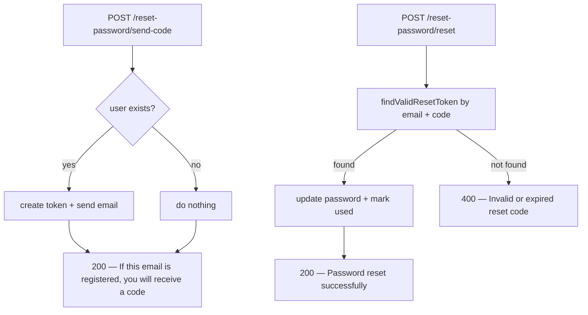

# Fix F-3: user enumeration on password reset

## The problem

Two endpoints reveal whether an email is registered:

**`POST /api/auth/reset-password/send-code`** — `startPasswordReset` throws a 404 with `"User not found."` when the email is unknown:

```71:76:healthy-paws-service/src/features/authentication/authentication.service.ts
  public async startPasswordReset(email: string): Promise<void> {
    try {
      const user = await this.authenticationRepository.findUserByEmail(email);
      if (!user) {
        throw new ClientError(ClientErrorMessages.USER_NOT_FOUND, 404);
      }
```

**`POST /api/auth/reset-password/reset`** — `resetPassword` also throws a 404 when the email is unknown:

```147:150:healthy-paws-service/src/features/authentication/authentication.service.ts
    const user = await this.authenticationRepository.findUserByEmail(email);
    if (!user) {
      throw new ClientError(ClientErrorMessages.USER_NOT_FOUND, 404);
    }
```

The frontend renders the backend's `message` field, so `"User not found."` is shown directly to any attacker probing the API.

## The fix

**Always return 200 with the same success message**, regardless of whether the email exists. Only perform the real work (create token, send email) when the user does exist. This is the standard industry pattern for any password-reset or "magic link" flow.

The invariant to preserve:
- `verifyResetCode` and `resetPassword` already validate the code against the DB, so they will naturally fail with `"Invalid or expired reset code."` for unknown emails (no valid token exists). No enumeration occurs there.
- The only change needed to `resetPassword` is removing the early 404 for a missing user — if the email doesn't exist, `findValidResetToken` will return nothing and the existing `"Invalid or expired reset code."` path triggers, which is correct and non-enumerable.



## Files & changes

### 1. [src/features/authentication/authentication.service.ts](healthy-paws-service/src/features/authentication/authentication.service.ts)

**`startPasswordReset`** — remove the 404 throw; silently return when user is not found:

```ts
public async startPasswordReset(email: string): Promise<void> {
  try {
    const user = await this.authenticationRepository.findUserByEmail(email);
    if (!user) {
      return; // silently succeed — do not reveal whether email is registered
    }
    // ... rest unchanged
  }
}
```

**`resetPassword`** — remove the 404 throw for unknown email; the `findValidResetToken` check that follows will handle it:

```ts
public async resetPassword(email: string, code: string, newPassword: string): Promise<void> {
  const user = await this.authenticationRepository.findUserByEmail(email);

  const token = user
    ? await this.authenticationRepository.findValidResetToken(user.id, code)
    : null;

  if (!token) {
    throw new ClientError(ClientErrorMessages.INVALID_RESET_CODE, 400);
  }
  // ... rest unchanged
}
```

### 2. [src/errors/constants.ts](healthy-paws-service/src/errors/constants.ts)

Update `RESET_CODE_SENT` in `SuccessMessages` to a deliberately vague message:

```ts
RESET_CODE_SENT = "If this email is registered, you will receive a reset code.",
```

This is what the frontend displays to the user. The previous `"Reset code sent to your email."` implicitly confirms the email exists. The new message is identical for known and unknown addresses.

## What this does NOT change

- `verifyResetCode` — already returns `false` (→ 400) for unknown emails; no enumeration risk.
- The 3-step flow structure, endpoints, or request/response shapes — unchanged.
- Frontend code — it reads the `message` field, which it will still display correctly.
- `USER_NOT_FOUND` constant — kept; it may still be used elsewhere (e.g. future admin endpoints). The key change is that the reset flow stops using it.

## Files changed

- [src/features/authentication/authentication.service.ts](healthy-paws-service/src/features/authentication/authentication.service.ts) — `startPasswordReset` and `resetPassword`
- [src/errors/constants.ts](healthy-paws-service/src/errors/constants.ts) — `RESET_CODE_SENT` message text