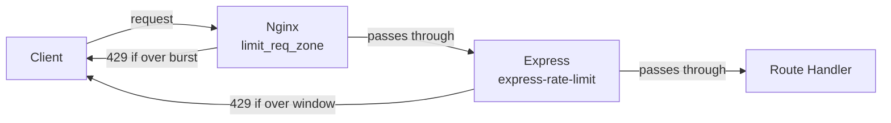

# Fix F-5: No rate limiting on auth endpoints

## Current state

Neither layer has throttling:
- [`healthy-paws-service/src/features/authentication/authentication.routes.ts`](healthy-paws-service/src/features/authentication/authentication.routes.ts) — plain `router.post()` calls, no middleware
- [`healthy-paws-wrapper/nginx/nginx.conf`](healthy-paws-wrapper/nginx/nginx.conf) — proxies `/api/` with no `limit_req` directive
- `package.json` — no rate-limiting package installed

## The fix: two-layer defense



### Layer 1 — Express: `express-rate-limit`

Install the package:
```bash
npm install express-rate-limit
```

Create a new file [`src/core/middleware/rate-limit.ts`](healthy-paws-service/src/core/middleware/rate-limit.ts) with per-endpoint limiters:

```ts
import rateLimit from "express-rate-limit";

// Login: 10 attempts per 15 min per IP
export const loginLimiter = rateLimit({
  windowMs: 15 * 60 * 1000,
  max: 10,
  standardHeaders: true,
  legacyHeaders: false,
  message: { status: "error", message: "Too many login attempts. Please try again later." },
});

// Send reset code: 5 requests per hour per IP (sends email — expensive)
export const sendCodeLimiter = rateLimit({
  windowMs: 60 * 60 * 1000,
  max: 5,
  standardHeaders: true,
  legacyHeaders: false,
  message: { status: "error", message: "Too many requests. Please try again later." },
});

// Verify code + reset password: 10 per 15 min per IP
export const resetLimiter = rateLimit({
  windowMs: 15 * 60 * 1000,
  max: 10,
  standardHeaders: true,
  legacyHeaders: false,
  message: { status: "error", message: "Too many requests. Please try again later." },
});
```

Apply them in [`src/features/authentication/authentication.routes.ts`](healthy-paws-service/src/features/authentication/authentication.routes.ts):

```ts
import { loginLimiter, sendCodeLimiter, resetLimiter } from "../../core/middleware/rate-limit";

router.post("/login", loginLimiter, authenticationController.login);
router.post("/reset-password/send-code", sendCodeLimiter, authenticationController.startPasswordReset);
router.post("/reset-password/verify-code", resetLimiter, authenticationController.verifyResetCode);
router.post("/reset-password/reset", resetLimiter, authenticationController.resetPassword);
```

### Layer 2 — Nginx: `limit_req_zone`

In [`healthy-paws-wrapper/nginx/nginx.conf`](healthy-paws-wrapper/nginx/nginx.conf), add a zone in the `http` block and apply it to the `/api/` location:

```nginx
http {
    # 10 MB zone keyed by IP — stores ~160 000 states
    limit_req_zone $binary_remote_addr zone=auth_limit:10m rate=10r/m;

    server {
        location /api/ {
            limit_req zone=auth_limit burst=5 nodelay;
            limit_req_status 429;
            # ... existing proxy_pass directives unchanged
        }
    }
}
```

- `rate=10r/m` — allows 10 requests per minute (≈ 1 every 6 s) across all auth endpoints at the gateway level
- `burst=5 nodelay` — allows short bursts of up to 5 extra requests before rejecting
- `limit_req_status 429` — returns standard HTTP 429 Too Many Requests instead of the default 503

## Limits summary

| Endpoint | Express window | Express max | Nginx backstop |
|---|---|---|---|
| POST /api/auth/login | 15 min | 10 | 10 req/min + burst 5 |
| POST /api/auth/reset-password/send-code | 60 min | 5 | 10 req/min + burst 5 |
| POST /api/auth/reset-password/verify-code | 15 min | 10 | 10 req/min + burst 5 |
| POST /api/auth/reset-password/reset | 15 min | 10 | 10 req/min + burst 5 |

## Files changed

- [`healthy-paws-service/src/core/middleware/rate-limit.ts`](healthy-paws-service/src/core/middleware/rate-limit.ts) — new file (rate limiter instances)
- [`healthy-paws-service/src/features/authentication/authentication.routes.ts`](healthy-paws-service/src/features/authentication/authentication.routes.ts) — apply limiters per route
- [`healthy-paws-wrapper/nginx/nginx.conf`](healthy-paws-wrapper/nginx/nginx.conf) — add `limit_req_zone` + `limit_req`
- `healthy-paws-service/package.json` — `express-rate-limit` added as dependency