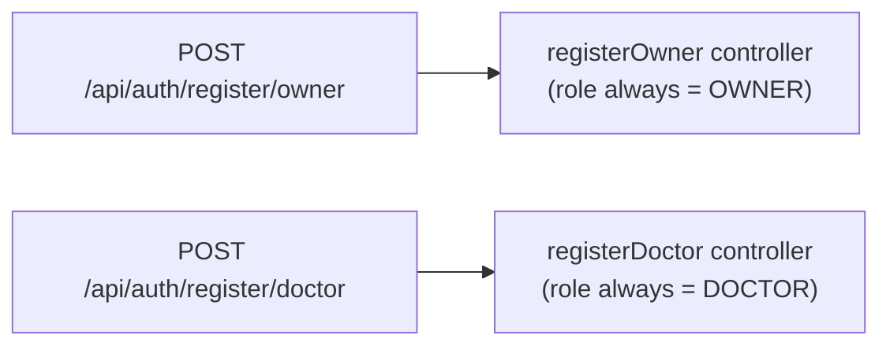

# Fix F-9: Client-controlled role on registration

## The problem

Both registration pages send `role: "owner"` or `role: "doctor"` in the request body:

```ts
// RegisterOwnerPage.tsx — payload
const payload = {
  role: "owner",   // ← client decides
  owner: { ... },
  pet: { ... },
};

// RegisterDoctorPage.tsx — payload
const payload = {
  role: "doctor",  // ← client decides
  doctor: { ... },
};
```

The backend reads that value and branches accordingly. Any HTTP client can send `role: "doctor"` with owner data (or vice versa) to register with an arbitrary role.

## The fix: route-based role determination

Replace the single `POST /api/auth/register` with two dedicated endpoints. The role is now encoded in the URL, which the server controls — it is never read from the request body.



### Backend changes

**[`registration.routes.ts`](healthy-paws-service/src/features/registration/registration.routes.ts)** — replace the single route with two:

```ts
router.post("/register/owner", registrationController.registerOwner);
router.post("/register/doctor", registrationController.registerDoctor);
```

**[`registration.controller.ts`](healthy-paws-service/src/features/registration/registration.controller.ts)** — split `register` into two focused methods. Neither reads `role` from the body:

```ts
public registerOwner = async (req, res, next) => {
  const { owner, pet } = req.body;
  // existing owner validation + service call
};

public registerDoctor = async (req, res, next) => {
  const { doctor } = req.body;
  // existing doctor validation + service call
};
```

The top-level `role` field, the `INVALID_ROLE` fallthrough, and the `if (role === ...)` branching are all removed.

### Frontend changes

**[`src/api/endpoint.ts`](healty-paws-frontend/src/api/endpoint.ts)** — replace the single constant with two:

```ts
export const registerOwnerEndpoint = "/api/auth/register/owner";
export const registerDoctorEndpoint = "/api/auth/register/doctor";
```

**[`src/pages/auth/register/RegisterOwnerPage.tsx`](healty-paws-frontend/src/pages/auth/register/RegisterOwnerPage.tsx)** — import `registerOwnerEndpoint`; remove `role` from payload; update the `axios.post` URL:

```ts
const payload = {
  owner: { name, email, password },
  pet: { ... },
};
await axios.post(`${API_BASE_URL}${registerOwnerEndpoint}`, payload);
```

**[`src/pages/auth/register/RegisterDoctorPage.tsx`](healty-paws-frontend/src/pages/auth/register/RegisterDoctorPage.tsx)** — import `registerDoctorEndpoint`; remove `role` from payload; update URL:

```ts
const payload = {
  doctor: { name, email, password, confirmPassword, ... },
};
await axios.post(`${API_BASE_URL}${registerDoctorEndpoint}`, payload);
```

## Files changed

- [`healthy-paws-service/src/features/registration/registration.routes.ts`](healthy-paws-service/src/features/registration/registration.routes.ts)
- [`healthy-paws-service/src/features/registration/registration.controller.ts`](healthy-paws-service/src/features/registration/registration.controller.ts)
- [`healty-paws-frontend/src/api/endpoint.ts`](healty-paws-frontend/src/api/endpoint.ts)
- [`healty-paws-frontend/src/pages/auth/register/RegisterOwnerPage.tsx`](healty-paws-frontend/src/pages/auth/register/RegisterOwnerPage.tsx)
- [`healty-paws-frontend/src/pages/auth/register/RegisterDoctorPage.tsx`](healty-paws-frontend/src/pages/auth/register/RegisterDoctorPage.tsx)